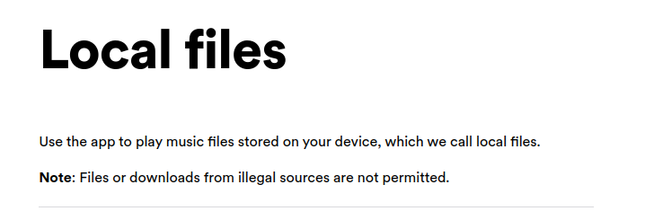
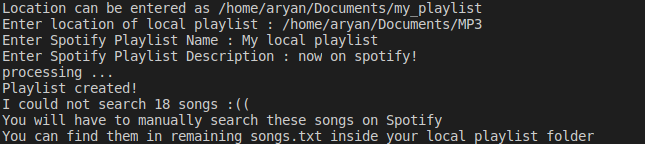

# transfer-local-playlist-to-spotify
Creates a Spotify playlist of your local playlist!

If you are from my generation, you probably would have tens of playlists consisting of mp3 songs downloaded from the internet, stored in your laptop or your "mp3-player". Now that online music streaming is here to stay, there should be a way to get your local playlists on Spotify!

However, this is what Spotify has to say : 

I don't think I'll shift my playlist to each device, whenever I wish to hear it. Also, I doubt that my mp3 files were legally downloaded :/
Even sites like [tunemymusic](tunemymusic.com) dont offer local music transfer to streaming services.

The way I see it - only way out is to search each local song on spotify, and add it to a spotify playlist. 
So, I just automated this boring task.

This script extracts the name of the local song files, and simply searches them on Spotify, and if present, adds it to a Spotify Playlist.

Here's how to run this script : 

1. Create a Spotify Developer Account.
  - Sign up on [Spotify Developers](https://developer.spotify.com/)
  - Go to Dashboard, and create a new App - give any random App name and description to get your credentials.
  - In the 'new App' settings, add your `REDIRECT_URI` as `http://127.0.0.1:8080/`
  - Note down your `Client ID`, `Client Secret`, `REDIRECT URI` & `Spotify Username` -> Enter these details in `credentials.txt` file.
  
2. Create a virtual environment (Python 3+)  (Optional, but preferred)
  - Install Spotipy : `pip install spotipy`
  - Install Audio-Metadata : `pip install audio-metadata`
  - Clone this repo : `git clone https://github.com/withoutwaxaryan/transfer-local-playlist-to-spotify.git`
  
3. Executing the Script
  - Activate your environment
  - Run the script : `python local_to_spotify.py` and follow along in the terminal!
   
   Will look like this : 
   
   
   
   P.S. You may have to search some songs manually. You can find the list inside your local playlist folder :))
   
   (Resources used : StackOverflow and [this video](https://youtu.be/jSOrEmKUd_c) to use Spotify API!)
